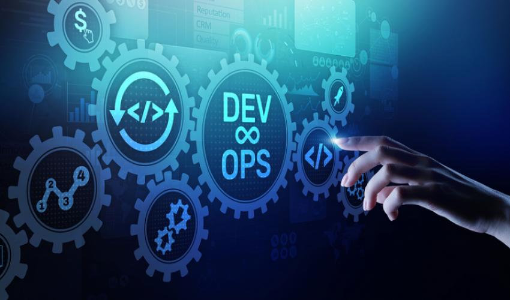

## About

Currently I am studying Communication Engineering at Aalto Univeristy. I am intersted in Software Engineering, I study on daily bases cutting edge web technolgies like node js, react, and I am more attracted towards cloud native tools Docker, Kubernetes. I have taken courses on Software project management and Networking technologies. So my focus for the comming 2020 new year is to become cloud developer. Learn more in cloud native application and orchestrating tools.

I have been coding in JavaScript ecosystem for 3 years, I always question about network traffic to a service. How does the service react to high traffic? Automatic scaling services and deployment. After getting to know container and kubernetes i get the high level understanding about these services.

<<<<<<< HEAD
[Look up the diary!](diary-061.md)
=======
[Look up the diary!](diary-061.md)
>>>>>>> c70c34c9f1b2ea7eea61e59ebd8b578478e787b0
